# Configuration de la Stack Elastic pour DoubleGo  

## Connexion et Inscription  
1. Inscrivez-vous pour un essai gratuit de 14 jours via [text](https://www.elastic.co/).  
2. Configurez les caractéristiques de base, telles que le logo et les paramètres de notification.  

---

## Stack Management  

### Création des Pipelines Custom  
1. Accédez à **Stack Management -> Ingest Pipelines**.  
2. Créez des pipelines personnalisés enfants (ex. `global@custom`, `logs-apm@custom`, etc.).  
3. Ajoutez des processeurs comme `set` et `script` pour personnaliser les pipelines.  

### Création des Templates d'Index  
1. Naviguez vers **Stack Management -> Index Management -> Templates**.  
2. Cliquez sur **Edit Template** pour créer ou modifier un template d'index.  

### Gestion des Politiques de Cycle de Vie des Index  
1. Configurez les phases (**hot**, **warm**, **frozen**) pour la rétention des données.  
2. Appliquez ces politiques aux templates d'index :  
    - Activez **Force merge data** et définissez le nombre de segments à 1.  
    - Marquez l'index et ses métadonnées en lecture seule (**Read only**).  
    - Déplacez les données vers la phase **frozen** après 13 jours et supprimez-les après 366 jours.  
    - Activez le **rollover** en définissant la taille maximale des shards primaires.  

---

## Création d'un Espace (Tenant) client  

1. Accédez à **Kibana -> Spaces** et cliquez sur **Create Space**.  
2. Remplissez les champs :  
    - **Name** : Nom de l'espace.  
    - **Description** : Description de l'espace.  
    - **Solution View** : Sélectionnez "Classic".  
3. Choisissez les fonctionnalités à rendre visibles dans le menu de navigation Elastic (Observability, Security, Management, etc.).  
4. Ajoutez une image pour l'apparence de l'espace, puis cliquez sur **Create Space**.  

### Création et Attribution de Rôles  
1. Dans **Security -> Roles**, créez un nouveau rôle :  
    - **Role Name** : Nom du rôle.  
    - **Role Description** : Description du rôle.  
2. Ajoutez des privilèges d'index pour contrôler l'accès aux types de données du cluster.  
3. Assignez le rôle créé à un tenant en le sélectionnant par son nom.  
4. Définissez les privilèges pour chaque groupe de fonctionnalités (Analytics, Elasticsearch, Observability, Security, Management) sur **All**, **None**, ou **Read**.  

---

## Création des Agents Policies et Ajout d'Intégrations  

### Création de l'Agent Policy
1. Accédez à **Management -> Fleet -> Agent Policies**.  
2. Cliquez sur **Create Agent Policy**.  
3. Remplissez les champs suivants :  
    - **Name** : Nom de la politique.  
    - **Description** : Description de la politique.  
    - **Default Namespace** : Utilisez une valeur similaire à celle définie pour les rôles (ex. `doublego`).  
4. Décochez la case **Collect agent metrics**.  
5. Laissez les autres paramètres avancés par défaut.  
6. Cliquez sur **Create Agent Policy**.  

### Ajout d'Intégrations  
1. Dans **Management -> Fleet -> Agent Policies**, sélectionnez la politique d'agent nouvellement créée.  
2. Cliquez sur **Add Integration** pour ajouter des intégrations.  
3. Remplissez les champs suivants :  
    - **Integration Name** : Nom de l'intégration.
    - **Description** : Une description de l'intégration (optionel). 
    - Décochez l'option avancée **Collect metrics from System instances** si elle est présente. (facultatif)  
4. Ajoutez l'intégration **Elastic Defend** si nécessaire, en configurant les options suivantes :  
    - **Malware Protections** :  
        - Niveau de protection : ***Detect***.  
        - ***Blocklist*** : Activé.  
        - ***Scan files upon modification*** : Désactivé.  
    - **Ransomware Protections** : Activé.  
    - **Malicious Behavior Protections** : Activé.  
    - **Memory Threat Protections** :  
        - Niveau de protection : ***Detect***.  
        - Décochez les cases ***File*** et ***API*** dans les sections ***Event*** sous ***Settings***.
5.  Ajoutez également l'intégration **Windows**, en activant les options suivantes pour la collecte des logs provenants d'évènement windows
    -   ***AppLocker/EXE and DLL***
    -   ***AppLocker/MSI and Script***
    -   ***Packaged app-Deployment***
    -   ***Packaged app-Execution***
    -   ***Windows Defender***
            
***Intégration de Base (à ajouter)***  
    - Elastic Defend  
    - Windows  
    - Auditd logs  
    - Osquery_Manager  
    - System   

**Note** : Adoptez une nomenclature pour les intégrations en combinant le nom de la politique d'agent et celui de l'intégration (ex. `DOUBLEGO System` pour l'intégration `system-1`).  

---

### Création de l'Agent Policy Connecteur
L'agent policy connecteur, est créer pour recevoir les intégrations liés aux services cloud (ex: Office365, aws, linode...)
1. Accédez à **Management -> Fleet -> Agent Policies**.  
2. Cliquez sur **Create Agent Policy**.  
3. Remplissez les champs suivants :  
    - **Name** : Nom de la politique.  (Préciser "Connector 1" à la suite)  
    - **Description** : Description de la politique.  
    - **Default Namespace** : Utilisez une valeur similaire à celle définie pour les rôles (ex. `doublego`).   
4. Laissez les autres paramètres avancés par défaut.  
5. Cliquez sur **Create Agent Policy**.  

**Note** : Utilisez une nomenclature standard pour les politiques d'agent connecteur en combinant le nom de l'espace client (namespace) avec le suffixe `Connector`(ex. `DOUBLEGO Connector1`). 

### Ajout des Intégrations à l'Agent Policy Connecteur

1. Accédez à **Management -> Fleet -> Agent Policies**.
2. Sélectionnez la politique d'agent connecteur nouvellement créée.
3. Cliquez sur **Add Integration**.
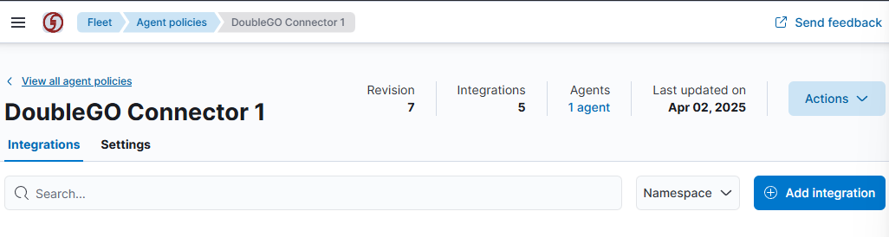
4. Dans la liste des intégrations disponibles, recherchez et sélectionnez les intégrations nécessaire à votre connecteur.
    ***Intégration connecteur de Base***  
        - Elastic Defend    
        - Microsoft Exchange Online  
        - Microsoft office 365
        - System   
        - AlienVault OTX
5. Configurez les paramètres spécifiques à l'intégration :
    - **Integration Name** : Nom de l'intégration en suivant la nomenclature des noms. (ex. `DoubleGO Connector1 o365`).
    - **Description** : Ajoutez une description (optionel).
    - Remplissez les champs spécifique selon les besoins de l'intégration que vous ajoutez (spécification d'intégration ci-dessous).
6. Cliquez sur **Save Integration** pour valider.

#### Étapes Spécifiques pour Certaines Intégrations
Certaines intégrations nécessitent des configurations spécifiques. Voici quelques exemples :

- **AlienVault OTX** :
  - Activez pour l'intégration, l'option **Ingest threat intelligence indicators from AlienVault OTX**.
  - Accédez dans **AlienVault OTX -> API Keys** et créez une clé API dédiée à l'intégration.
  - Copiez la clé API ainsi que le Token générée et conservez-la en lieu sûr.
  - Ajoutez la clé API et le Token AlienVault OTX respectivement dans les  champs **API Key** et **Token** de l'intégration dans Stack Elastic.
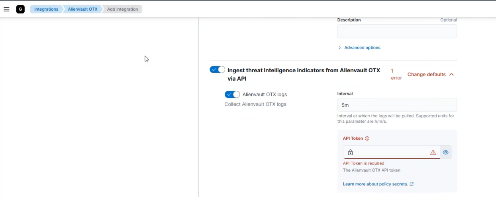 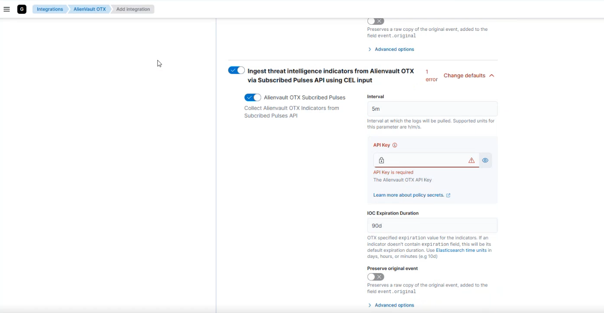

- **Office365** :
  - Cliquez sur l'intégration **Microsoft Office 365**  et laisser les paramètres specifiques par défaut.
  - Accédez à **Azure Active Directory -> Inscription d'application** et créez une application dédiée à l'intégration Office365 pour la collecte des logs.
  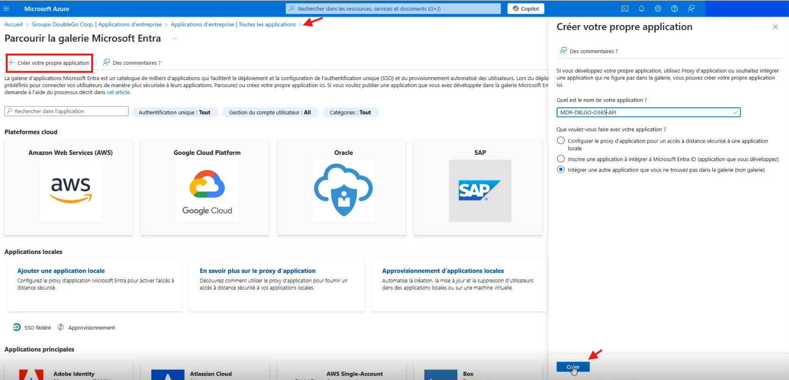
  - Copier le **ID d'application (client ID)** puis le renseigner dans le champ requis **Client ID** dans l'intégration o365 de Elastic.
  - Dans l'application créée, accédez à l'onglet **Certificats et secrets**, créez un secret client (client secret) et copiez-le immédiatement.
  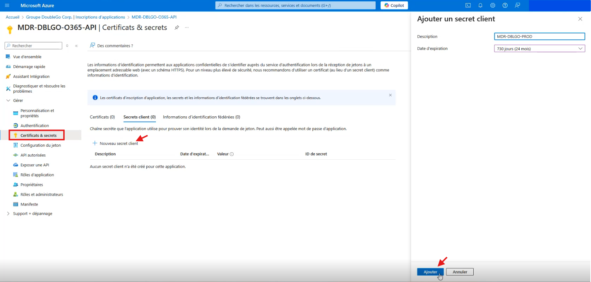
  - Rendez-vous dans l'onglet **API autorisées** et ajoutez les autorisations suivantes :  
  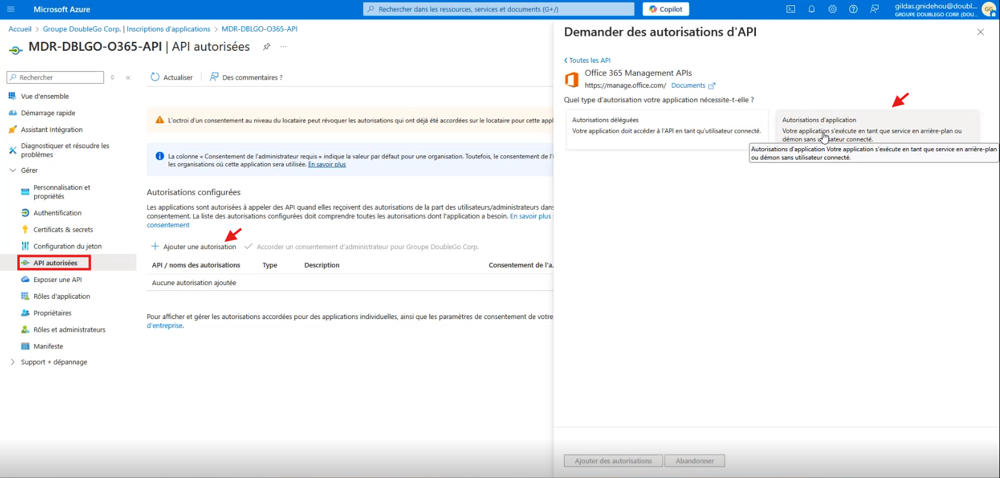
    - Sous **Office 365 Management APIs -> Autorisations déléguées** : `ActivityFeed.Read`.  
    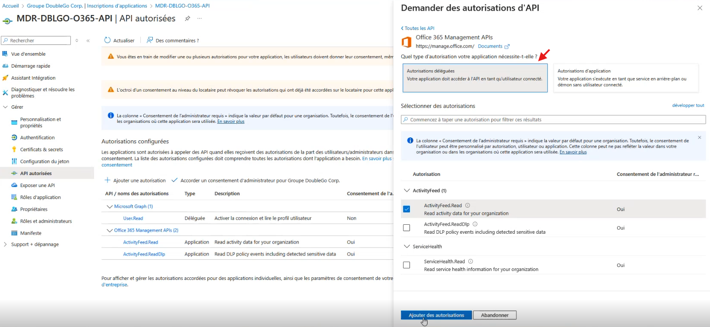
    - Sous **Office 365 Management APIs -> Autorisations d'application** : `ActivityFeed.Read` et `ActivityFeed.ReadDlp`.
    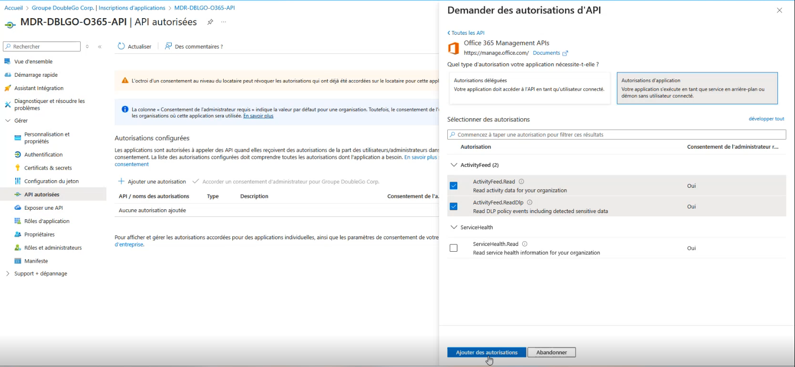  
    - Sous **API Microsoft Graph -> Autorisations déléguées** : `User.Read`.  
    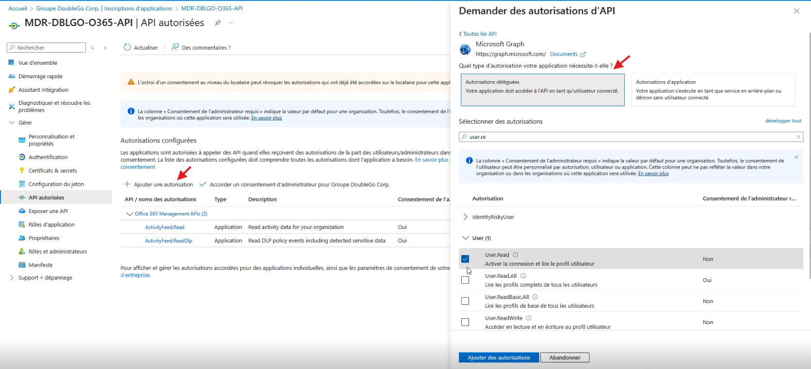
    - Sous **API utilisées par mon organisation -> Office 365 Exchange Online -> Autorisations d'application** : `ReportingWebService.Read.All`.
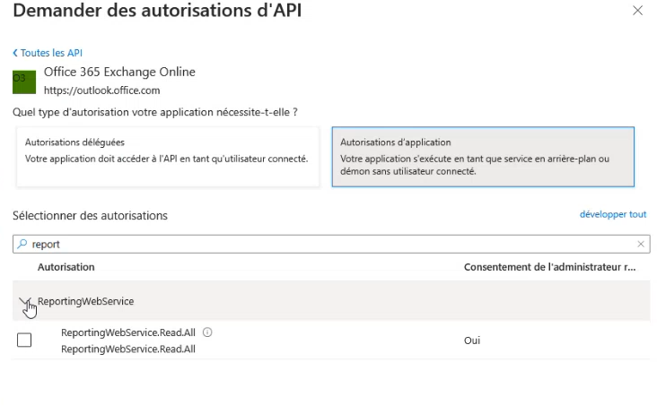
  - Accordez le consentement administrateur pour valider les autorisations d'application et déléguées.
  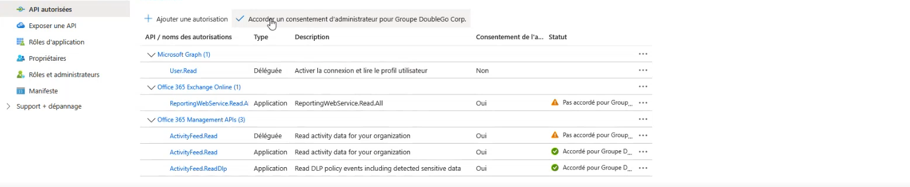
  - Dans l'onglet **Overview** de Microsoft Azure, copiez le **ID de répertoire (tenant ID)** puis le renseigner dans le champ **Tenant ID** dans l'intégration o365 dans Elastic.

- **Microsoft Exchange Online** :
  - Ajoutez la clé API Linode.
  - Configurez les paramètres de collecte des métriques.

---

## Personnalisation du Logo de la Stack  
1. Accédez à **Stack Management -> Advanced Settings -> Global Settings**.  
2. Ajoutez les logos personnalisés du client.  

---

## Installation de l'Agent Elastic sur les Postes  
1. Accédez à **Management -> Fleet -> Agent Policies**.  
2. Sélectionnez la politique d'agent souhaitée.  
3. Cliquez sur **Actions**, puis sur **Add Agent**.  
4. Choisissez la plateforme sur laquelle installer l'agent.  
5. Copiez et exécutez la commande en tant qu'administrateur sur le poste à enrôler.  

---

